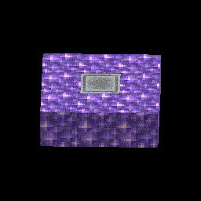
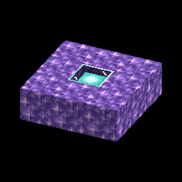

### โปรเจ็คต์ต้นฉบับมาจาก [Pretorer](https://github.com/Pretorer) นี้เป็นการ Fork เพื่อแก้ไขใช้ในเซิร์ฟเวอร์ Reimagined

# Amethysttravelling
Minecraft datapack สำหรับสร้างจุดวาร์ปเดินทางที่รวดเร็ว ใช้อเมทิสต์และทำให้เป็นทรัพยากรที่จำเป็นสำหรับการเดินทางที่รวดเร็ว

## วิธีใช้งาน
### การสร้าง
ในการสร้างจุดวาร์ป ต้องสร้างแพลตฟอร์ม 3x3 จากบล็อกอเมทิสต์
บล็อก "ตัวเร่งปฏิกิริยา" ตรงกลางจะกำหนดเวลาที่ใช้ในการเดินทางจากจุดหนึ่งไปยังช่องสัญญาณอย่างรวดเร็ว
นอกจากนี้ จุดวาร์ปบางจุดไม่สามารถคงสถานะใช้งานถาวรได้ในทุกมิติ
สำหรับสิ่งนี้จะต้องเลือก "ตัวเร่งปฏิกิริยา" ที่เหมาะสม
ในการเปิดใช้งานแพลตฟอร์มของจุดเดินทางที่รวดเร็ว คุณต้องยืนอยู่ตรงกลางชานชาลา

